<div align="center">
  

  <div align="center">
    <a href="README.md"></a>
    <a href="README.ja.md"></a>
  </div>
</div>

# 🌐 DocuMind MCP Server

> _"ドキュメンテーションの境界を超えて、デジタルの叡智へ"_

次世代の知的文書解析システム。Model Context Protocol (MCP) の力を駆使し、ドキュメントの新たな可能性を切り開く。

## ⚡ コアシステム

- 🧠 **ニューラルドキュメント解析**: 高度なアルゴリズムによるREADME総合評価
- 🔮 **ホログラフィックヘッダースキャン**: 次世代SVG視覚要素解析
- 🌍 **多次元言語サポート**: 超域言語ドキュメント検証
- 💫 **量子改善エンジン**: AI駆動型最適化提案

## 🚀 起動シーケンス

### システム要件

- Node.js 18+
- npm || yarn

### コア初期化

```bash
npm install
```

### マトリックスコンパイル

```bash
npm run build
```

### ニューラル開発リンク

リアルタイムニューラル接続を確立：
```bash
npm run watch
```

## 🛸 運用プロトコル

### システム構成

Claude Desktopメインフレームとの統合：

**Windowsターミナル**:
```json
// %APPDATA%/Claude/claude_desktop_config.json
{
  "mcpServers": {
    "documind-mcp-server": {
      "command": "/path/to/documind-mcp-server/build/index.js"
    }
  }
}
```

### ニューラルインターフェースコマンド

#### evaluate_readme
ドキュメント構造の量子解析を開始。

パラメータ：
- `projectPath`: 対象ディレクトリへのニューラルパス

リクエスト例：
```javascript
{
  name: "evaluate_readme",
  arguments: {
    projectPath: "/path/to/project"
  }
}
```

レスポンス例：
```javascript
{
  content: [
    {
      type: "text",
      text: JSON.stringify({
        filePath: "/path/to/project/README.md",
        hasHeaderImage: true,
        headerImageQuality: {
          hasGradient: true,
          hasAnimation: true,
          // ... その他の品質指標
        },
        score: 95,
        suggestions: [
          "言語切り替えバッジの追加を検討してください",
          // ... その他の提案
        ]
      })
    }
  ]
}
```

## 🔮 開発マトリックス

### デバッグプロトコル

MCP Inspectorを介してニューラルネットワークにアクセス：

```bash
npm run inspector
```

### トラブルシューティングガイド

#### 一般的な問題と解決策

1. **ヘッダー画像が検出されない**
   - SVGファイルが`assets/`ディレクトリに配置されているか確認
   - SVGファイルが正しいXML構造を持っているか検証
   - ファイルのアクセス権限を確認

2. **言語バッジが認識されない**
   - shields.ioフォーマットを使用しているか確認
   - HTML構造が推奨パターンに従っているか確認
   - 中央揃えが正しく設定されているか確認

3. **ビルドエラー**
   - `node_modules`を削除して依存関係を再インストール
   - TypeScriptのバージョンがプロジェクト要件と一致しているか確認
   - 修正したファイルの構文エラーをチェック

4. **MCP接続の問題**
   - stdioトランスポートの設定を確認
   - Claude Desktop構成を確認
   - 設定内のファイルパスが正しいか確認

#### パフォーマンス最適化

1. **SVG解析**
   - より高速な解析のためSVGの複雑さを最小限に
   - 効率的なグラデーションとアニメーションを使用
   - 品質を維持しながらファイルサイズを最適化

2. **README解析**
   - 最適な解析のためのコンテンツ構造化
   - 推奨されるmarkdownパターンの使用
   - バッジ配置ガイドラインの遵守

## 🔬 API ドキュメント

### コアクラス

#### ReadmeService

README解析と評価の主要サービス。

```typescript
class ReadmeService {
  // プロジェクト内の全READMEファイルを解析
  async evaluateAllReadmes(projectPath: string): Promise<ReadmeEvaluation[]>
  
  // 単一のREADMEファイルを評価
  private async evaluateReadme(dirPath: string, readmePath: string): Promise<ReadmeEvaluation>
  
  // 言語バッジ設定を評価
  private evaluateLanguageBadges(content: string): BadgeEvaluation
}
```

#### SVGService

SVGヘッダー画像解析の専門サービス。

```typescript
class SVGService {
  // SVGヘッダー画像の品質を評価
  public evaluateHeaderImageQuality(imgSrc: string, content: string): HeaderImageQuality
  
  // SVG内のプロジェクト固有要素をチェック
  private checkProjectSpecificImage(svgContent: string, readmeContent: string): boolean
}
```

### コアインターフェイス

```typescript
interface ReadmeEvaluation {
  filePath: string;
  hasHeaderImage: boolean;
  headerImageQuality: HeaderImageQuality;
  isCentered: {
    headerImage: boolean;
    title: boolean;
    badges: boolean;
  };
  hasBadges: {
    english: boolean;
    japanese: boolean;
    isCentered: boolean;
    hasCorrectFormat: boolean;
  };
  score: number;
  suggestions: string[];
}

interface HeaderImageQuality {
  hasGradient: boolean;
  hasAnimation: boolean;
  hasRoundedCorners: boolean;
  hasEnglishText: boolean;
  isProjectSpecific: boolean;
}
```

### エラーハンドリング

サーバーは包括的なエラーハンドリングを実装：

```typescript
try {
  const evaluations = await readmeService.evaluateAllReadmes(projectPath);
  // 結果の処理
} catch (error) {
  const errorMessage = error instanceof Error ? error.message : String(error);
  return {
    content: [{
      type: 'text',
      text: `評価エラー: ${errorMessage}`
    }],
    isError: true
  };
}
```

## ⚡ ライセンス

MITプロトコルの下で運用。